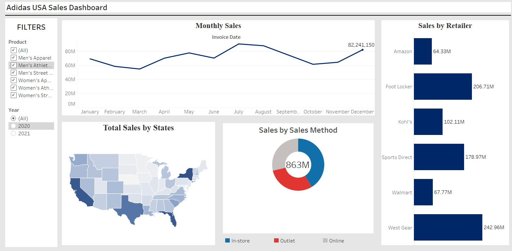

# Adidas USA Sales Analysis Dashboard

## Project Overview

This repository contains the source code and data for the Adidas USA Sales Analysis Dashboard created using Tableau. The dashboard provides insights and visualizations about Adidas sales in the USA.

## Dashboard Features

- **Sales Overview**: Visualizes sales trends, revenue, and profit over time.
- **Product Performance**: Analyzes the performance of different Adidas products.
- **Region-specific Sales**: Breaks down sales data by region within the USA.
- **Customer Segmentation**: Segments customers and analyzes their buying behavior.

## Dashboard Link

You can access the live dashboard here: [Adidas USA Sales Analysis Dashboard](#)

## Data Sources

The data used for this dashboard is included in this repository. It includes:

- Sales data
- Product data
- Customer data
- Region data

## How to Use

1. Clone the repository to your local machine.
2. Import the data into your Tableau project.
3. Open the Tableau workbook file.
4. Explore the dashboard and analyze the data.

## Contributing

If you'd like to contribute to this project, feel free to fork the repository and submit a pull request. We welcome any improvements or additional features.

## License

This project is licensed under the [MIT License](LICENSE), which means you are free to use, modify, and distribute the code, but please attribute the original work.

## Contact

If you have any questions or need further information, feel free to contact the project owner:

- Name: Your Name
- Email: your@email.com
- LinkedIn: [Your LinkedIn Profile](https://www.linkedin.com/in/your-profile)

Happy Dashboarding!
